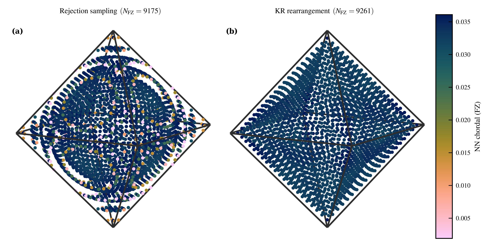

# Uniform Grids on $\mathrm{SO}(3)/K$

Reference implementation for *Approximately Uniform Grids over Crystal Orientations* by Z. T. Varley and M. De Graef.

This repository constructs constant-Jacobian Knothe-Rosenblatt transports from the homochoric ball to crystallographic fundamental zones, yielding structured uniform grids on $\mathrm{SO}(3)/K$ for the cyclic, dihedral, tetrahedral, octahedral, and icosahedral groups. The release tree is intentionally narrow: the entire figure pipeline lives under `figures/`, rendered paper figures live in `paper_figures/`, and the paper source lives in `paper/`.

<p align="center">
  
</p>

## At a glance

- Direct sampling on $\mathrm{SO}(3)/K$
- Constant-cost KR maps for $C_k$, $D_k$, $T$, $O$, and $I$

## Export the paper figures

```bash
pip install -r requirements.txt
python -m publication.export_figures
```

Use `python -m publication.export_figures --only 1 4 6` to export a subset. The exporter writes PNG, PDF, and vector EPS into `paper_figures/`. Details on artwork sizing and EPS generation are in [publication/README.md](publication/README.md).

## Regenerate cached data

The maintained generators are:

```bash
python -m figures.generate_cubochoric_anisotropy
python -m figures.generate_nn_cdf_data
python -m figures.generate_grid_method_metrics
python -m figures.generate_thomson_relaxation
```

Figure 1 and Figure 6 are built directly from code by the exporter. Figure 1 uses the same maintained plotting module as the interactive view and benefits from a working `pykeops` installation.

## Repository layout

| Path | Purpose |
|---|---|
| `src/` | Core numerical routines for grid construction, symmetry operators, metrics, and Thomson relaxation |
| `mappings/` | Analytic KR transports and fitting code retained in full |
| `figures/` | Maintained plotting modules, generator entrypoints, cached data, and saved layout JSON |
| `publication/` | Export driver and ordered output stems |
| `paper_figures/` | Rendered paper figures |
| `paper/` | Manuscript and caption fragments |
| `assets/` | Supplemental media kept for the paper release |

## Notes

- `paper_figures/*.eps` are vector exports produced from the TeX PDF via Poppler `pdftops`; they are not raster wrappers.
- The cluttered root-level rendered artefacts and obsolete figure variants were intentionally removed from the release tree.
- If you want to inspect or tune a maintained panel interactively, run the module directly, for example `python -m figures.cubochoric_anisotropy`.

## Citation

```text
coming soon...
```

## License

Released under the MIT License. See [LICENSE](LICENSE).

<details>
<summary><strong>Appendix: cross-eyed stereogram of the symmetry-extended grid on $\mathrm{SO}(3)$</strong></summary>

The video below shows an octahedral-group KR grid extended to all of $\mathrm{SO}(3)$ by the 24 elements of $O$, in homochoric coordinates. To free-fuse: sit roughly 50 cm from the screen, zoom until the two checkered spheres are about 10 cm apart, and cross your eyes until they overlap.

<p align="center">
  <video controls loop muted playsinline width="550">
    <source src="assets/stereogram_so3_o.mp4" type="video/mp4" />
  </video>
</p>

</details>
