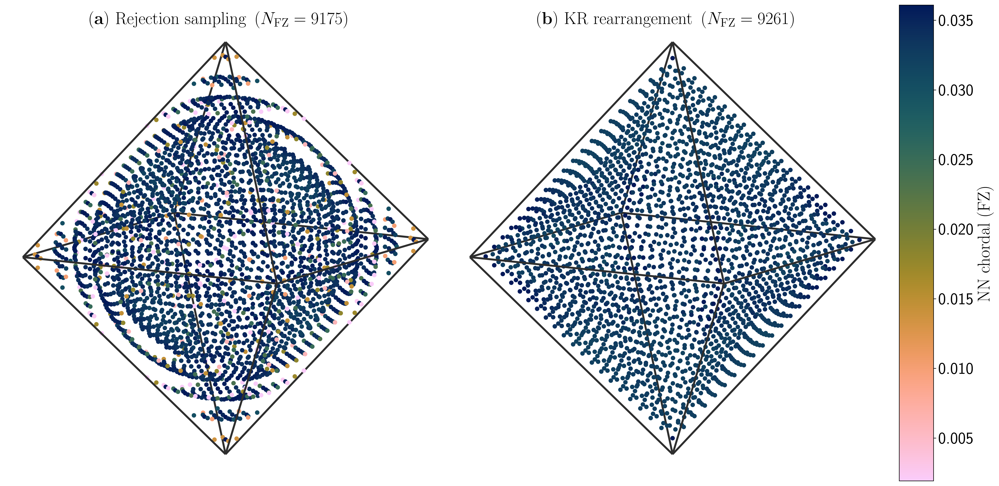
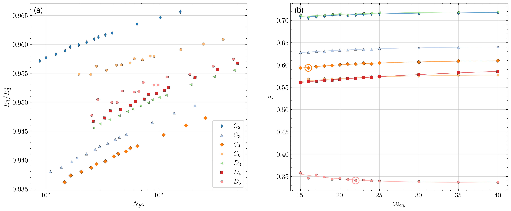
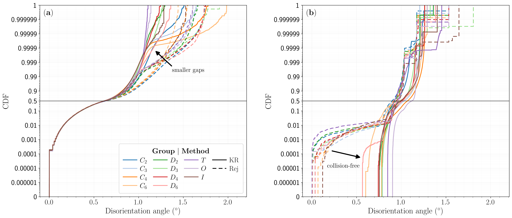
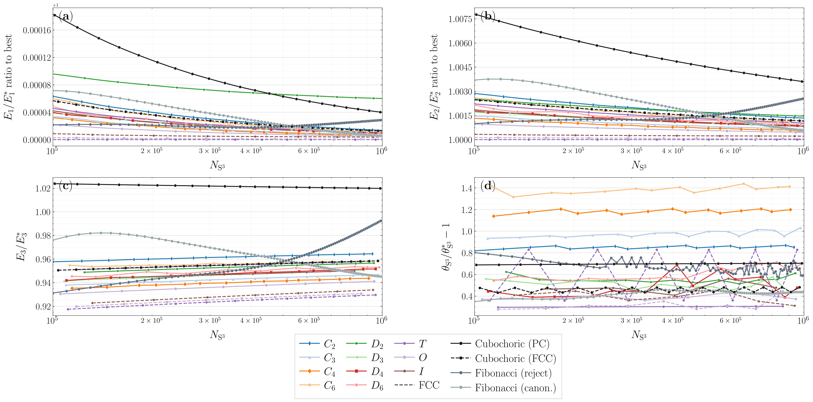
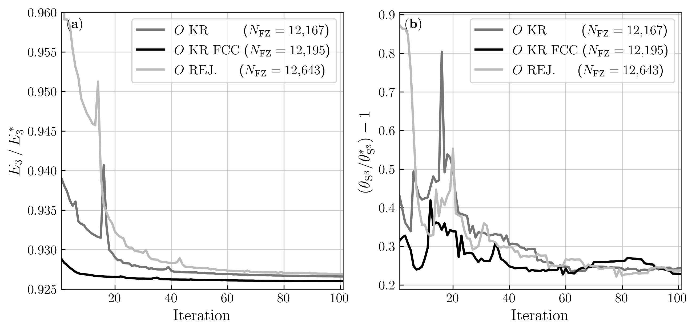
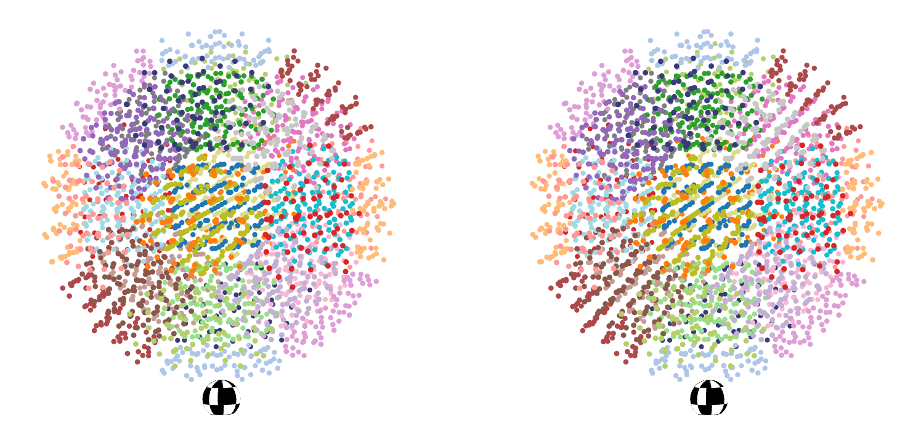

# Uniform Grids of Crystallographic Orientations

**Uniform orientation grids on SO(3)/K for all crystallographic 3D rotational symmetry groups.**

This repository accompanies the paper tentatively titled ''*Grids over Crystallographic Quotients of SO(3)*'' (citation coming soon). It implements **Knothe–Rosenblatt (KR) grids**: constant-Jacobian mappings from the homochoric ball onto each crystallographic fundamental zone (FZ), giving structured, uniform point sets on $\mathrm{SO}(3)/K$ for all Laue groups and the icosahedral group. The same construction, extended by the symmetry operations in $K$, yields uniform grids on $\mathrm{SO}(3)$ itself.

Below is a stereoscopic MP4 showing the symmetry-extended grid on $\mathrm{SO}(3)$ formed by filling orientation space with copies of the octahedral group's fundamental zone (blue points in the center of the ball). The plot is in homochoric coordinates. To observe the 3D illusion, position your eyes approximately 50 cm from your screen. Zoom in/out in your browser until the physical separation between the two checkered spheres is approximately 10 cm. Prevent your head from tilting. Cross your eyes until the checkered spheres below the plotted points overlap with each other. Adjust your head forward or backward until you can comfortably look at the checkered sphere. Then the entire plot will appear to be 3D. Each of the other 23 painted regions is a copy of the fundamental zone grid at the center of the ball which has been transformed by one of the symmetry elements of the symmetry group $O$.

<p align="center">
  <video controls loop muted playsinline style="max-width: 550px; width: 100%; height: auto;">
    <source src="figure8.mp4" type="video/mp4" />
  </video>
</p>

---

## Why KR grids on  $\mathrm{SO}(3)/K$?

- **Direct on the fundamental zone** — Sample $\mathrm{SO}(3)/K$ instead of sampling $\mathrm{SO}(3)$ and distorting density.
- **Uniform by construction** — Measure-preserving KR rearrangements in spherical homochoric coordinates.
- **All Laue groups and more** — $C_k$, $D_k$, $T$, $O$, and $I$. Same pipeline: cubochoric reference grid → homochoric → KR map into the FZ.
- **Uniform on $\mathrm{SO}(3)$ too** — Augment a KR FZ grid by the elements of $K$ to get a structured grid on the full rotation group.

---

## What is in this repo

- **Figure pipeline** — Data generation (`figure*_gen.py`, `figure4_b.py`, …), interactive column layout (`figure*_col.py`), non-interactive stacked exports (`figure*_manual.py`), and IUCR submission exports (`iucr/export_panels.py`).
- **Core computational modules** — `grid_FZ.py`, `grid_SO3.py`, `orientation_ops.py`, `laue_ops.py`, `covering_radius.py`, `riesz_energy.py`, `thomson_relax_new.py`, `batlow.py`.
- **KR mappings and fitting workflows** — Complete implementation and fitting scripts under `mappings/`.

### Figure script map

| Role | Scripts |
|------|---------|
| Generate saved data | `figure2_gen.py`, `figure3_gen.py`, `figure4_b.py`, `figure5.py`, … |
| Interactive tuning (column layout) | `figure1_col.py` … `figure5_col.py` |
| Stacked PDF/PNG (with panel letters) | `figure1_manual.py` … `figure5_manual.py` |
| **IUCR submission exports (all paper figures)** | `python -m iucr.export_panels` → `iucr_panels/` |
| Legacy / full-width interactive | `figure1.py`, `figure2_plot.py`, `figure3.py`, `figure4.py`, … |

See [iucr/README.md](iucr/README.md) for typography (1.5–3 mm text at column width) and output file names.

---

## Running

Run from this directory:

```bash
pip install -r requirements.txt
```

**Reproduce paper figures from saved data** (no recomputation):

```bash
python figure2_manual.py
python figure3_manual.py
python figure4_manual.py
python figure5_manual.py
python -m iucr.export_panels    # all panels + combined figs for IUCR (see iucr/README.md)
```

**Regenerate data** (slow; optional): run the `*_gen.py` / `figure4_b.py` / `figure5.py` scripts first, then the manual or IUCR export commands above.

**Interactive layout** (optional): `python figure2_col.py`, etc.

> **Note on KeOps / GPU:** Some computations use `pykeops` (via `covering_radius.py`). In practice, KeOps is most reliable/performance-oriented with an NVIDIA GPU and working CUDA toolchain, and installation can be finicky depending on your system/compiler/CUDA setup.

## Figure guide

### Figure 1 — Rejection vs KR in $\mathrm{SO}(3)/T$
Side-by-side 3D views of tetrahedral-group ($T$) fundamental-zone grids: cubochoric rejection versus KR mapping at matched sizes, with point color tied to nearest-neighbor chordal spacing in the FZ.

<p align="center">
  
</p>

### Figure 2 — Axial anisotropy in cubochoric KR grids
Two-panel sweep results from cubochoric KR grids: left plots $E_3/E_3^*$ versus $N_{S^3}$, right plots the best axial ratio setting $\hat r$ versus $\mathrm{cu}_{xy}$ with log quadratic fits.

<p align="center">
  
</p>

### Figure 3 — NN disorientation overlays
Two-panel Figure 3: left shows witness-to-grid nearest-neighbor disorientation CDF overlays, right shows within-grid self-nearest-neighbor disorientation CDF overlays; both compare KR against cubochoric rejection across Laue groups.

<p align="center">
  
</p>

### Figure 4 — Energy and covering-radius scaling
Four panels versus $N_{S^3}$: $E_1/E_1^*$, $E_2/E_2^*$, $E_3/E_3^*$, and $\theta_{\mathrm{cov}}/\theta^*$, with one KR curve per Laue group plus cubochoric and Fibonacci baselines; includes dashed KR-FCC overlays for $T$, $O$, and $I$.

<p align="center">
  
</p>

### Figure 5 — Thomson relaxation trajectories
Two-panel iteration traces for group $O$ under Thomson relaxation across four initializations (KR-FCC, KR-primitive-cubic, cubochoric rejection, random): left is $E_3/E_3^*$ versus iteration, right is covering radius (degrees) versus iteration.

<p align="center">
  
</p>

### Figure 6 — Symmetry-extended KR grid on $\mathrm{SO}(3)$
Shows an octahedral-group KR FZ grid augmented by all 24 symmetry operators in homochoric coordinates; points are colored by operator index so each symmetry copy is visually separated.

<p align="center">
  <video controls loop muted playsinline style="max-width: 550px; width: 100%; height: auto;">
    <source src="figure7.mp4" type="video/mp4" />
  </video>
</p>

<p align="center">
  
</p>

### Figure 7 — Primitive cubic vs FCC cubochoric fill (group $O$)
Compares primitive-cubic and FCC fillings of cubochoric space before KR mapping into the octahedral ($O$) fundamental zone, showing cubochoric, homochoric, and FZ views with FZ nearest-neighbor coloring.

<p align="center">
  
</p>

## Citation

```text
(citation coming soon)
```

## License

This project is released under the MIT License. See [LICENSE](LICENSE).
